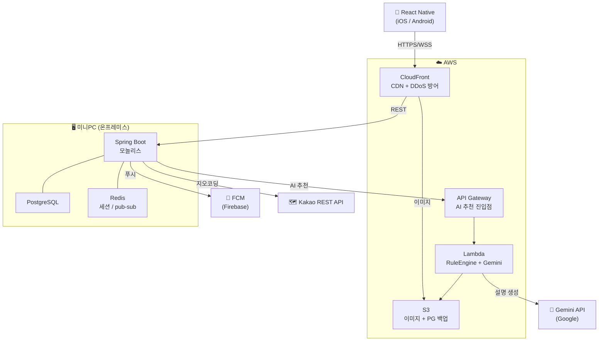

# Component Dependency
# 배달비 절약을 위한 음식 공동 구매 앱

---

## 의존성 매트릭스

행 = 의존하는 쪽 / 열 = 의존 대상 / ● = 직접 의존

```
               auth  room  order  chat  notif  map  ai   admin  Lambda  S3  Redis  PG
auth            -     -     -      -      -     -    -     -       -      -    ●     ●
room            ●     -     -      ●      ●     ●    -     -       -      ●    ●     ●
order           ●     ●     -      -      ●     -    -     -       -      -    -     ●
chat            ●     ●     -      -      -     -    -     -       -      -    ●     ●
notification    -     -     -      -      -     -    -     -       -      -    -     ●
map             -     -     -      -      -     -    -     -       -      -    -     -
ai (client)     ●     -     -      -      -     ●    -     -       ●      -    ●     -
admin           ●     ●     ●      -      -     -    -     -       -      -    -     ●
```

---

## 통신 패턴

### 1. 모바일 앱 → 미니PC (Spring Boot)

```
[React Native]
    │ HTTPS (REST)
    ├──→ CloudFront (캐시 히트 시 여기서 응답)
    │        │
    │        └──→ [미니PC] Spring Boot (포트 8080)
    │
    │ WSS (WebSocket/STOMP)
    └──→ [미니PC] Spring Boot (포트 8080, /ws)
```

- REST: JWT Bearer 토큰 인증
- WebSocket: STOMP CONNECT 시 JWT 검증

### 2. 미니PC → AWS

```
[미니PC: Spring Boot]
    │ HTTPS
    ├──→ API Gateway → Lambda     // AI 추천 요청
    │
    │ HTTPS (AWS SDK v2)
    ├──→ S3                       // 이미지 업로드/다운로드
    │
    └──→ FCM (Google)             // 푸시 알림 (Firebase Admin SDK)
```

### 3. 미니PC 내부

```
[Spring Boot]
    │ JDBC
    ├──→ PostgreSQL (포트 5432)   // 영구 데이터
    │
    │ Lettuce (Redis Client)
    └──→ Redis (포트 6379)        // 세션, pub/sub, 캐시
```

### 4. AWS 내부 (Lambda)

```
[Lambda: RecommendationHandler]
    │ HTTPS
    ├──→ Gemini API               // 설명 텍스트 생성
    │
    │ AWS SDK
    └──→ S3                       // 식당 데이터 로드 (선택)
```

---

## 시스템 아키텍처 다이어그램 (Mermaid)



---

## 결합도 관리 원칙

| 원칙 | 적용 방법 |
|------|----------|
| 모듈 간 직접 Service 주입 최소화 | 크로스 모듈 호출은 도메인 이벤트(`ApplicationEventPublisher`) 사용 |
| 외부 의존 격리 | `KakaoMapClient`, `FCMClient`, `LambdaGatewayClient` 등 어댑터 클래스로 래핑 |
| 테스트 격리 | 어댑터 인터페이스 추출 → 단위 테스트 시 Mock 대체 가능 |
| AWS 의존 격리 | `S3Client`, `LambdaGatewayClient` 빈으로 분리 → 로컬 테스트 시 Mock S3 사용 |

---

## 데이터 흐름 — 주요 시나리오

### 시나리오 A: 방 참여 + 채팅

```
모바일 → POST /api/rooms/{id}/join
  → RoomService.joinRoom()
    → RoomRepository (PG 저장)
    → ChatService.publishSystemMessage("입장")
      → RedisPubSubService.publish("chat:{roomId}")
        → Redis pub/sub → 모든 연결된 WS 클라이언트에 STOMP 전달
```

### 시나리오 B: AI 추천 요청

```
모바일 → POST /api/ai/recommend
  → AIRecommendService
    → LambdaGatewayClient → API Gateway → Lambda
      → RuleEngine.filterAndRank()          // 순수 함수 (PBT 대상)
      → GeminiClient.generateExplanation()  // Top-3에 대해 Gemini 호출
      → 결과 반환
  → Redis 캐시 저장 (10분)
  → 모바일에 추천 결과 + 설명 텍스트 응답
```

### 시나리오 C: 주문 확정 + 알림

```
방장 → POST /api/rooms/{id}/confirm
  → OrderService.confirmOrder()
    → RoomService.updateStatus(ORDER_COMPLETE)  // PG 트랜잭션
    → NotificationService.sendPushToRoom()
      → FcmTokenRepository (PG 조회)
      → FCMClient.sendMulticast()               // FCM → 모바일 푸시
```
