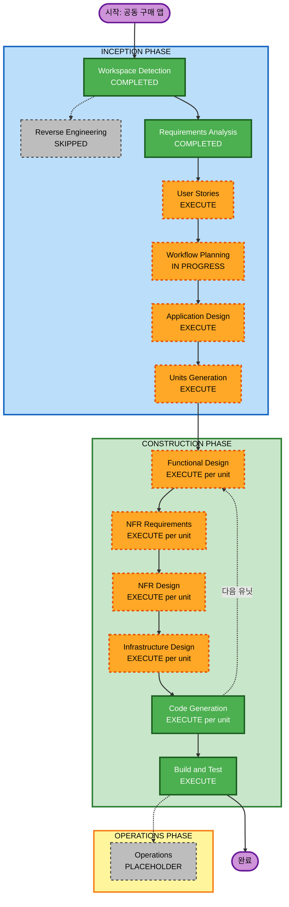

# Execution Plan
# 배달비 절약을 위한 음식 공동 구매 앱

---

## Detailed Analysis Summary

### Change Impact Assessment

| 항목 | 여부 | 설명 |
|------|------|------|
| User-facing changes | Yes | 모바일 앱 전체 UI/UX 신규 개발 |
| Structural changes | Yes | React Native 앱 + Spring Boot 백엔드 2-tier 신규 구축 |
| Data model changes | Yes | User, Room, OrderItem, Message 등 신규 도메인 모델 |
| API changes | Yes | REST API 전체 신규, WebSocket 엔드포인트 신규 |
| NFR impact | Yes | Security Baseline 전체, PBT Partial, 실시간 성능 요건 |

### Risk Assessment

| 항목 | 수준 |
|------|------|
| **Risk Level** | Medium-High |
| **주요 리스크** | WebSocket + FCM 통합 복잡도, 카카오맵 API 연동, Security Baseline 15개 규칙 |
| **Rollback Complexity** | Low (Greenfield — 기존 시스템 없음) |
| **Testing Complexity** | Complex (PBT + Security + Integration) |

---

## Workflow Visualization



### 텍스트 대안 (Text Alternative)

```
INCEPTION PHASE
  [COMPLETED] Workspace Detection
  [SKIPPED]   Reverse Engineering (Greenfield)
  [COMPLETED] Requirements Analysis
  [EXECUTE]   User Stories
  [EXECUTE]   Workflow Planning  ← 현재
  [EXECUTE]   Application Design
  [EXECUTE]   Units Generation

CONSTRUCTION PHASE (유닛별 반복)
  [EXECUTE]   Functional Design
  [EXECUTE]   NFR Requirements
  [EXECUTE]   NFR Design
  [EXECUTE]   Infrastructure Design
  [EXECUTE]   Code Generation
  [EXECUTE]   Build and Test

OPERATIONS PHASE
  [PLACEHOLDER] Operations
```

---

## Phases to Execute

### INCEPTION PHASE

- [x] Workspace Detection — COMPLETED
- [x] Reverse Engineering — SKIPPED (Greenfield, 기존 코드 없음)
- [x] Requirements Analysis — COMPLETED
- [ ] User Stories — **EXECUTE**
  - **근거**: 방장/참여자 2개 페르소나, 사용자 경험 중심 앱, 인수 기준 명확화 필요
- [x] Workflow Planning — IN PROGRESS
- [ ] Application Design — **EXECUTE**
  - **근거**: User, Room, Order, Message 등 신규 도메인 컴포넌트 다수, 서비스 레이어 설계 필요
- [ ] Units Generation — **EXECUTE**
  - **근거**: React Native 앱 / Spring Boot 백엔드 / 실시간 통신 레이어 — 유닛 분리로 병렬 개발 가능

### CONSTRUCTION PHASE (유닛별 실행)

- [ ] Functional Design — **EXECUTE** (per-unit)
  - **근거**: Room 상태 머신, 배달비 분배 알고리즘, WebSocket 메시지 흐름 등 상세 설계 필요
- [ ] NFR Requirements — **EXECUTE** (per-unit)
  - **근거**: Security Baseline 15개 규칙 + PBT Partial 적용, 기술 스택 확정 필요
- [ ] NFR Design — **EXECUTE** (per-unit)
  - **근거**: NFR Requirements 실행되므로 자동 실행
- [ ] Infrastructure Design — **EXECUTE** (per-unit)
  - **근거**: Docker 컨테이너, DB 암호화(SECURITY-01), 네트워크 설정(SECURITY-07) 설계 필요
- [ ] Code Generation — **EXECUTE** (per-unit, ALWAYS)
- [ ] Build and Test — **EXECUTE** (ALWAYS)

### OPERATIONS PHASE

- [ ] Operations — PLACEHOLDER

---

## 예상 유닛 구성 (Units Generation에서 확정)

| 유닛 | 설명 |
|------|------|
| Unit 1 | 백엔드 — 회원/인증 (Spring Boot + JWT) |
| Unit 2 | 백엔드 — 공동 구매 방 관리 (Room 도메인) |
| Unit 3 | 백엔드 — 실시간 채팅 (WebSocket / STOMP) |
| Unit 4 | 백엔드 — 위치 및 지도 연동 (카카오맵 API) |
| Unit 5 | 모바일 앱 — React Native 화면 (인증 + 방 목록 + 채팅) |

*최종 유닛 수는 Application Design 및 Units Generation 단계에서 확정됩니다.*

---

## Success Criteria

- **Primary Goal**: 배달비를 나눠 내는 공동 구매 방 개설/참여 MVP 완성
- **Key Deliverables**:
  - React Native 앱 (iOS/Android)
  - Spring Boot REST API 서버
  - WebSocket 실시간 채팅
  - 카카오맵 기반 방 탐색
  - FCM 푸시 알림
- **Quality Gates**:
  - Security Baseline 15개 규칙 전체 준수
  - PBT Partial (배달비 분배 로직 속성 테스트)
  - 단위 테스트 + 통합 테스트 포함
